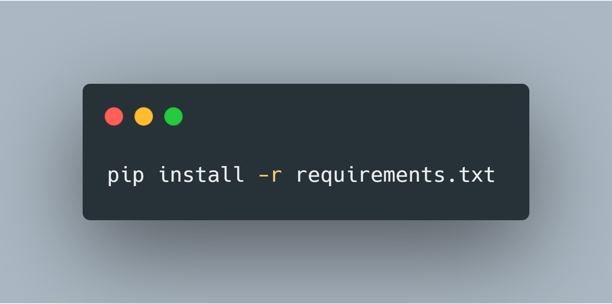
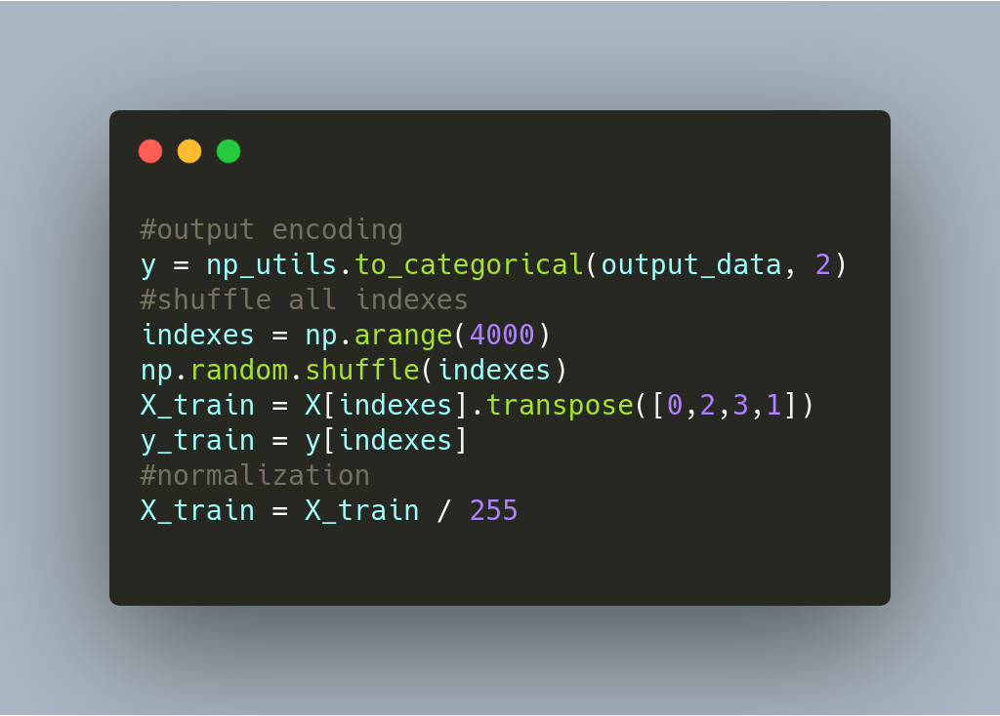
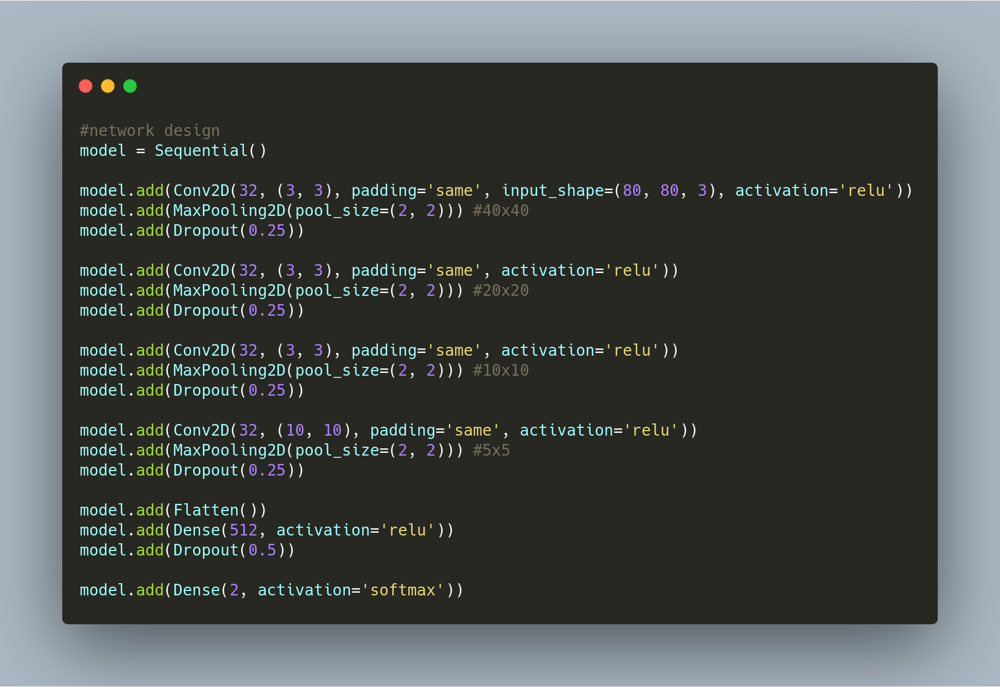
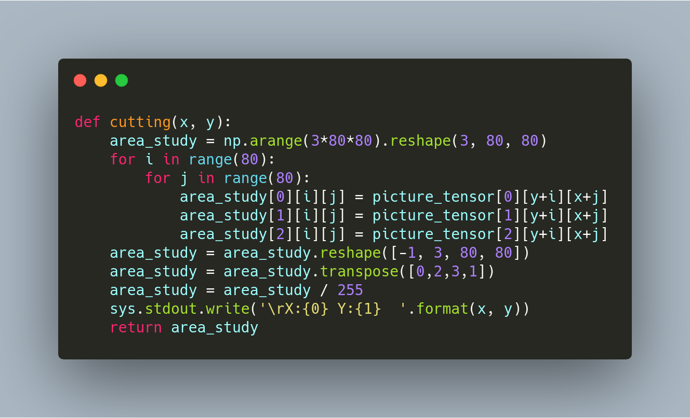

# Detecting Ships using Deep Learning

## Steps Involved

### 0. Setting Up the Enviornment

First, you need to setup your enviornment, i.e., you need to install all the necessary libraries for this project. We will be using Python 3.6 for this project. Clone the repository and run the following command to install all the required libraries.

### 1.Preparing Data

#### Downloading Dataset

Dataset can be downloaded [here](https://www.kaggle.com/rhammell/ships-in-satellite-imagery)

### 2. Network

### 3. BBox Generation Code

#### To view full code , [click here](https://nbviewer.jupyter.org/github/ucalyptus/Detecting-Ships/blob/master/detecting-ships.ipynb)

## About Me

### [LinkedIn](https://linkedin.com/in/sayantan-das-95b50a125/)
### [Github](https://github.com/ucalyptus)
### [Medium](https://medium.com/@sayantandas30011998)

# Contribute
* [Issues](https://github.com/ucalyptus/dirac-dev/issues)
